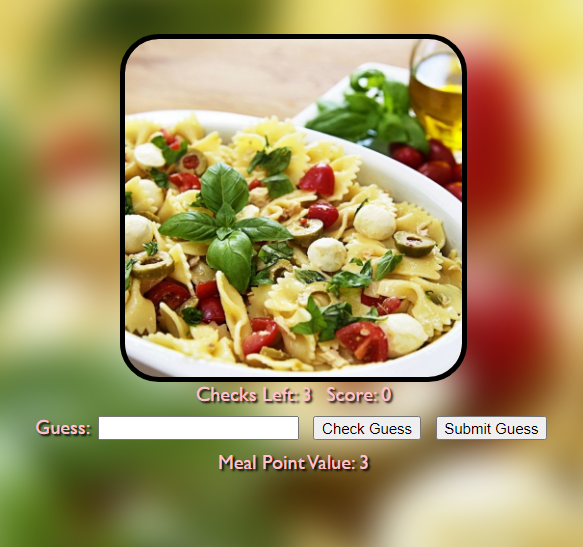
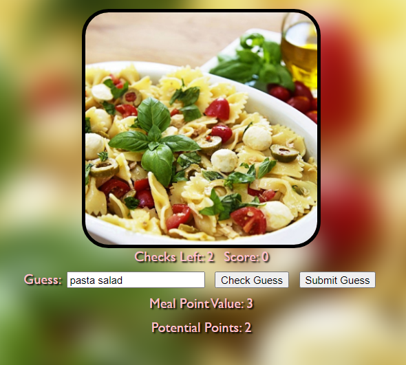
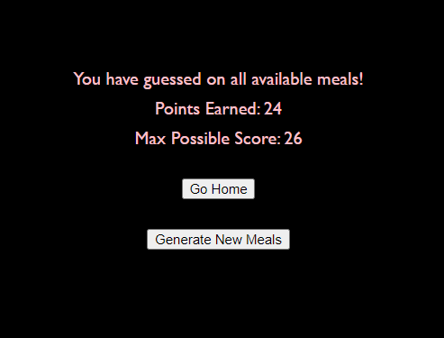

# Meal Guesser
This web app, built with the Django framework, fetches RESTful JSON data from the [Free Meal API](https://www.themealdb.com/api.php) to obtain multiple random meals and temporarily add them to an SQLite database. 
This culminates into a fun minigame where you guess the name of a meal by just its image.

Every correct word you guess from the meal's name gives 1 point. You have 3 chances to check how many points your guess earns before permanently submitting your guess.
**How many points do you think you can get?**

## Instructions

To play the game please follow these instructions:

1. Before getting started, be sure to have [Git](https://git-scm.com/downloads) and [Python](https://www.python.org/downloads/) installed

2. Open up a terminal and change directory to a new, empty folder.

3. Clone this repository 

    `git clone https://github.com/sharktrexer/Meal_Guesser`

4. Install the required packages

    `pip install -r requirements.txt`

5. Rename the ".envExample" file to ".env"

6. Run the server and navigate to http://127.0.0.1:8000/ 

    `python manage.py runserver`

7. If you want the server to run on a different port, see [here](https://docs.djangoproject.com/en/5.1/ref/django-admin/#runserver)

## Examples

